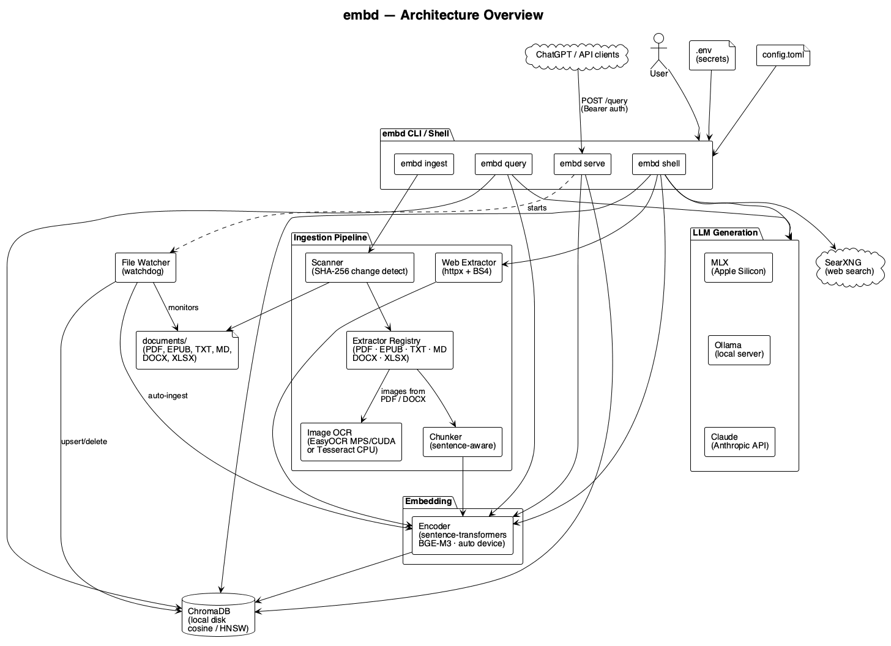

# embd — Architecture

## System diagram



## Overview

```
documents/  →  Ingest (extract + chunk + embed)  →  ChromaDB on disk
                                                          ↓
CLI / TUI / HTTP API  →  Query (embed + search)  →  LLM generates answer
```

## Ingest flow

1. **Scan** — recursively walk `documents_dir`, hash each file, skip unchanged.
2. **Extract** — dispatch by type: PyMuPDF (PDF), ebooklib (EPUB), python-docx (DOCX), openpyxl (XLSX), plain read (TXT/MD), httpx+BS4 (URLs).
3. **Chunk** — sentence-aware sliding window (`chunk_size` / `chunk_overlap`).
4. **Embed** — sentence-transformers (e.g. BGE-M3) on MPS/CUDA/CPU.
5. **Store** — upsert into ChromaDB (cosine space, HNSW index).

Chunk IDs are deterministic from `(source_key, page, chunk_index)` — re-ingesting unchanged files is a no-op.

## Query flow

1. **Embed** the question with the same model.
2. **Search** ChromaDB HNSW for top-k nearest chunks.
3. **Generate** an answer with the configured LLM (MLX, Ollama, or Claude) using retrieved passages as context.

## Key modules

| Module | Responsibility |
|--------|---------------|
| `src/embd/encoder.py` | Loads sentence-transformers, auto-selects device |
| `src/embd/store/` | ChromaDB wrapper — upsert, query, delete |
| `src/embd/ingestion/` | Extractors, chunker, scanner, file watcher |
| `src/embd/llm/` | MLX, Ollama, Claude generation backends |
| `src/embd/server.py` | FastAPI HTTP API (OpenAI retrieval-plugin compatible) |
| `src/embd/config.py` | Loads `config.toml` + `.env` |

## Storage

ChromaDB persists to `chroma_db/`:
- `chroma.sqlite3` — metadata, chunk text, IDs
- `<segment-uuid>/` — HNSW index files (vectors, graph links, norms)

Metadata per chunk: `source_filename`, `page_num`, `chunk_index`, `file_hash`, `embedding_model`, `ingestion_timestamp`.
